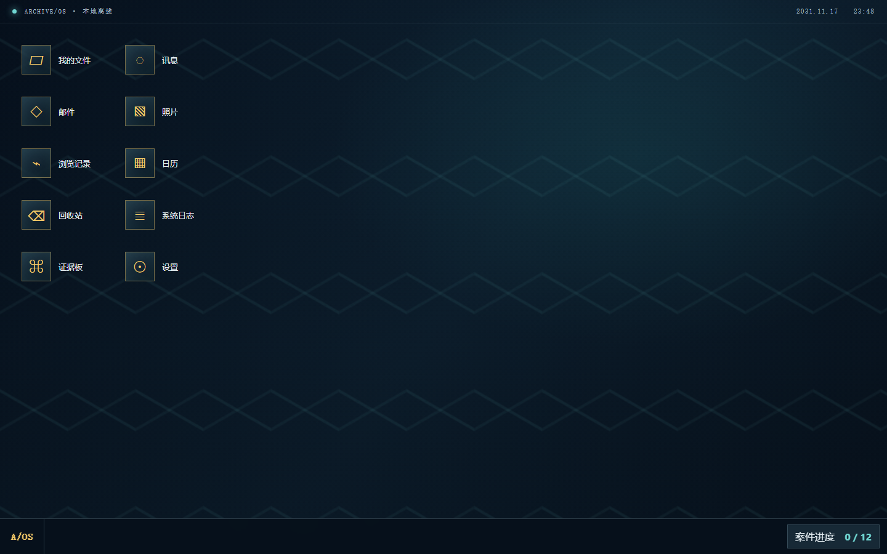
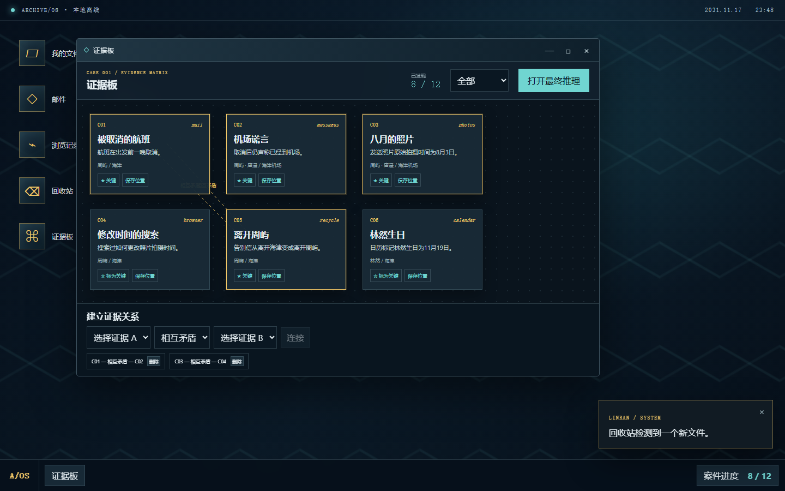
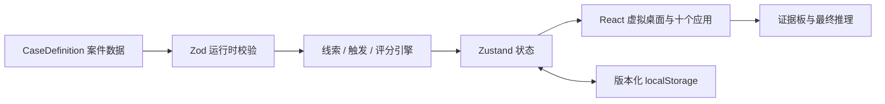

# 遗失电脑博物馆：最后一次登录

> 一款通过遗失电脑中的文件、消息与系统痕迹展开的网页悬疑调查游戏。

**在线演示：[https://phlxxx.github.io/lost-desktop-museum/](https://phlxxx.github.io/lost-desktop-museum/)**





## 核心玩法

你恢复了自由纪录片剪辑师周屿电脑中的最后一次会话。打开文件、讯息、邮件、照片、浏览记录、日历、回收站和系统日志，找出 12 条线索，在证据板建立关系，并解释航班起飞前一晚究竟发生了什么。

- 完整案件《没有出发的旅行》，目标游玩 15—30 分钟
- 原创 `ARCHIVE/OS 3.1` 启动与复古未来主义桌面
- 十个应用窗口，支持拖动、最小化、最大化、恢复和关闭
- 12 条按调查动作解锁的线索、幂等剧情事件与动态回收站文件
- 可拖动证据卡、关键证据、四种关系及确定性推理评分
- `localStorage` 自动存档、刷新恢复、版本迁移和安全重置
- 系统音效、异常效果、扫描线强度与减弱动画支持
- 完全静态运行，不使用服务器、账户、外部 AI 或运行时热链

## 本地运行

需要 Node.js 24+ 与 npm 11+。

```bash
npm ci
npm run dev
```

浏览器打开 Vite 输出的本地地址。生产构建与预览：

```bash
npm run build
npm run preview
```

## 测试命令

```bash
npm run lint
npm run test
npm run test:coverage
npm run build
npm run e2e
npm run check
```

`npm run check` 顺序执行 TypeScript、ESLint、Vitest 和生产构建；Playwright E2E 单独运行。

## 技术架构



- `src/cases/`：类型、Zod schema 与案件内容
- `src/engine/`：无 React 依赖的线索、触发、评分和存档逻辑
- `src/store/`：游戏状态与窗口状态
- `src/features/`：启动、桌面、窗口、应用、证据板
- `e2e/`：完整玩家旅程、刷新恢复和重置

## 案件数据结构

`CaseDefinition` 聚合时间线、虚拟文件、聊天、邮件、照片、浏览记录、日历、日志、线索、触发器和推理问题。组件只发出 `InvestigationAction`，不直接判断案件答案。详细扩展协议见 [docs/CASE_FORMAT.md](docs/CASE_FORMAT.md)。

## 制作第二个案件

1. 在 `src/cases/case-002/` 创建独立内容文件。
2. 为每条线索定义唯一 ID、来源和具体发现动作。
3. 使用本地 SVG/音频生成逻辑，不增加运行时网络依赖。
4. 通过 Zod 校验、时间线排序和线索可达性测试。
5. 将案件注册到案件选择层；窗口系统与核心引擎无需修改。

## GitHub Pages 部署

Vite 本地 `base` 为 `/`；Actions 环境根据 `GITHUB_REPOSITORY` 自动推导 `/<仓库名>/`。`.github/workflows/deploy-pages.yml` 构建并上传 `dist`，使用 GitHub Pages workflow source 部署。

## 隐私

游戏不发送调查数据。存档、证据关系和个人推理只保存在当前浏览器的 localStorage 中。仓库不包含真实聊天账号、邮件、人物隐私、密钥或 Cookie。

## 路线图

1. 第二个案件
2. 玩家案件编辑器
3. 案件导入与导出

## 许可证

代码与原创资源使用 [MIT License](LICENSE)。

<details>
<summary>剧透：案件核心方向</summary>

周屿取消了航班，发送旧机场照片制造已经离开的假象，并准备以“林然”的身份摆脱原有生活。档案不能完全证明他最终是否成功离开，也不能排除林然曾是另一个真实使用者。

</details>

## English

**Lost Desktop Museum: Last Login** is a browser-based mystery told through the files, messages, photos, logs, and contradictions left on an abandoned computer. Reconstruct one complete case, connect twelve clues on an evidence board, and submit a deterministic final deduction. The game runs entirely as a static site and keeps all progress locally.
