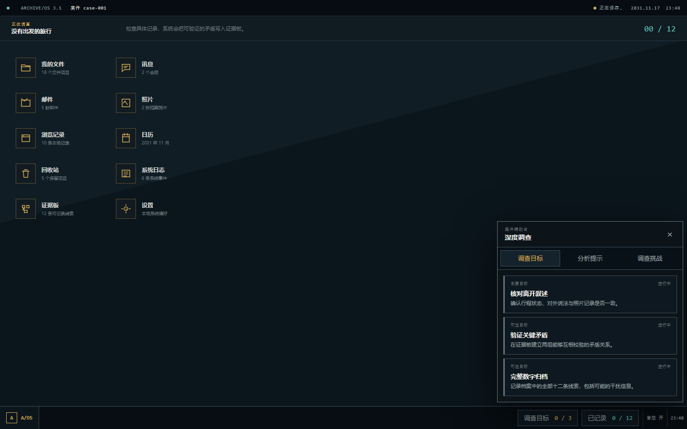
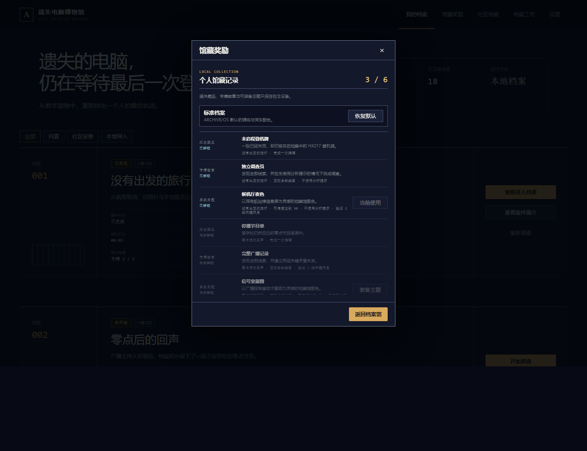
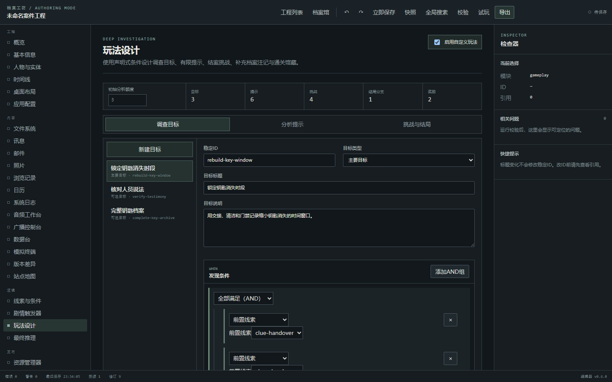
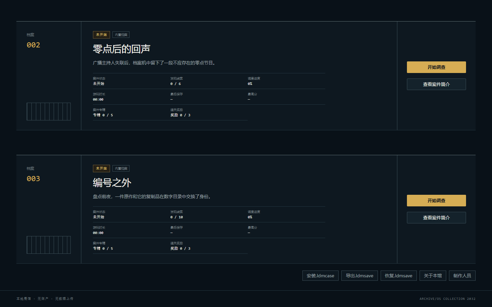
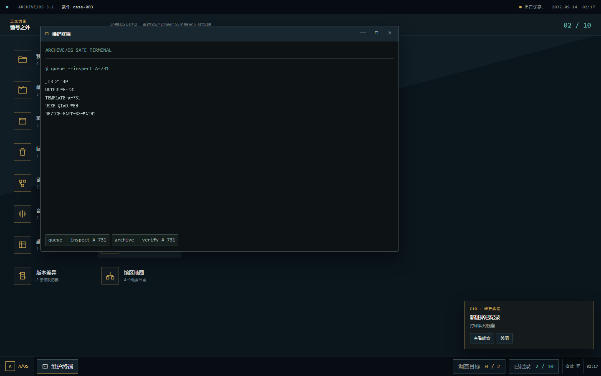
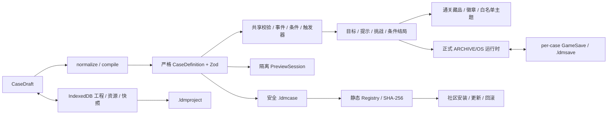

# 遗失电脑博物馆

> 从数字遗物中重新拼出一个人的最后轨迹；用有限提示、调查目标与结案挑战完成更深入的档案复原。

当前版本：**v0.6.0 — Deep Investigation**

**在线演示：[https://phlxxx.github.io/lost-desktop-museum/](https://phlxxx.github.io/lost-desktop-museum/)**








### 档案 003 实机记录






## 当前内容

- 三宗内置完整案件：《没有出发的旅行》、《零点后的回声》与《编号之外》，合计 28 条可达线索
- 档案馆、案件详情、启动、调查、推理、结算的完整生命周期
- 数据驱动的主要/可选调查目标、每案 3 点有限分析额度和逐层提示
- 结案挑战、跨周目专精记录，以及按调查表现选择的补充档案注记
- 通关纪念藏品、专精徽章与两套可解锁 ARCHIVE/OS 主题；重开案件后仍保留
- `ARCHIVE/OS 3.1` 桌面、窗口系统、证据板和 16 类可注册应用
- 每案件独立存档、`.ldmsave` 进度导入/导出及旧存档迁移
- 本地“档案工坊”：从工程创建到 `.ldmcase` 发布的完整闭环
- 静态“档案交换站”：社区目录、搜索筛选、详情、SHA-256 安装、更新、回滚与卸载
- 收藏、私人评分、私人备注及 IndexedDB 离线社区缓存；无公开评分或下载统计
- 档案工坊社区投稿 ZIP 与 GitHub Pull Request 审核流程
- 空白工程、最小可玩模板和两宗内置案件副本起点
- 人物、时间线、桌面、文件、聊天、邮件、线索、条件、触发器、玩法、推理与资源编辑
- 800ms IndexedDB 自动保存、80 步撤销/重做、20 个恢复快照、多标签只读保护
- 使用真实运行时的隔离试玩、调试面板、校验中心和确定性 ZIP round-trip
- 完全静态运行，不使用服务器、账户、远程 AI 或运行时热链

## 档案工坊闭环

```text
创建工程 → 编辑内容 → 校验/试玩 → 导出 .ldmcase
        → 准备社区投稿 → GitHub PR → 静态 Registry
        → 下载 → SHA-256/包复验 → 安装 → 离线调查
```

工程备份使用 `.ldmproject`，可继续编辑但不能直接游玩；`.ldmcase` 是通过严格校验的正式案件包；`.ldmsave` 只保存玩家进度。旧 `.lmdcase` 仅兼容导入，之后统一导出为 `.ldmcase`。

完整操作见 [深度调查指南](docs/DEEP_INVESTIGATION.md)、[档案工坊使用指南](docs/EDITOR_GUIDE.md) 与 [社区指南](docs/COMMUNITY_GUIDE.md)。社区源仓库为 [lost-desktop-museum-community](https://github.com/PHLXXX/lost-desktop-museum-community)，[静态社区目录](https://phlxxx.github.io/lost-desktop-museum-community/) 和 [Registry v1 索引](https://phlxxx.github.io/lost-desktop-museum-community/registry/v1/index.json) 已上线；数据与安全细节见 [安装安全](docs/COMMUNITY_INSTALL_SECURITY.md)。

## 本地运行

需要 Node.js 24+ 与 npm 11+。

```bash
npm ci
npm run dev
```

生产构建与预览：

```bash
npm run build
npm run preview
```

## 测试与模板命令

```bash
npm run typecheck
npm run lint
npm run test
npm run test:coverage
npm run test:editor
npm run test:community
npm run validate:cases
npm run validate:editor-examples
npm run package:editor-examples
npm run generate:community-fixtures
npm run build
npm run e2e
npm run check
```

投稿 CLI 的完整参数与 `--dry-run` 示例见 [社区投稿指南](docs/COMMUNITY_PUBLISHING.md)。

`npm run check` 顺序执行 TypeScript、ESLint、全部 Vitest、内置案件、编辑器模板和生产构建。CI 另外执行编辑器测试、模板打包往返、依赖审计与 Chromium E2E。

## 技术架构



- `src/cases/`：严格 Schema、三宗内置案件与内存/已安装案件注册表
- `src/engine/`：线索、条件、触发、评分、验证与存档逻辑
- `src/gameplay/`：兼容玩法生成、目标、提示、挑战、奖励与结局选择引擎
- `src/rewards/`：跨案件本地馆藏、奖励去重与预置主题白名单
- `src/app/`、`src/features/`：应用生命周期、档案馆与真实调查运行时
- `src/editor/`：草稿编译、存储、历史、注册表和可视化编辑模块
- `src/preview/`：隔离试玩与调试
- `src/packages/`：工程、案件、存档包与 ZIP 安全
- `src/community/`：固定源客户端、缓存、搜索、安装、更新、偏好和社区界面
- `examples/editor/`：可验证、可打包的最小案件模板
- `e2e/`：玩家回归、深度调查、编辑器闭环、响应式与多标签保护

更完整的模块关系见 [编辑器架构](docs/EDITOR_ARCHITECTURE.md)。

## 玩家操作

- 双击桌面图标或按 `Enter` 打开应用；拖动标题栏移动，拖动边角缩放。
- 点击左下角 `A/OS` 或按 `Esc` 打开系统菜单并保存返回档案馆。
- 任务栏中的 `调查目标 n/m` 打开深度调查面板；也可从系统菜单进入。
- “分析提示”按调查方向、操作建议、精确定位逐层显示，每层消耗 1 点；提示使用会随当前调查存档。
- 任务栏同时显示运行应用、保存状态和线索数；证据板用于建立关系并提交推理。
- 结案后会记录本次目标、挑战与提示使用。重新调查会清空本轮提示和进度，但保留最高分与历史专精。
- 结案页会列出本次获得的藏品、徽章和主题；在档案馆打开“馆藏奖励”可查看条件并装备已解锁主题。
- 奖励只影响收藏展示与界面配色，不增加提示、不提供答案，也不随案件重新调查或卸载而消失。
- 档案馆可区分内置、社区安装与本地导入案件；社区详情链接不会自动下载或安装。

## 隐私与安全

社区浏览需要联网，案件安装后可离线游玩。收藏、评分、备注和调查进度只保存在本设备；不会上传存档、推理、工程、设备标识或行为分析。社区源在构建时固定，不能由 URL 参数或设置替换。第三方案件不能执行代码、加载远程资源或携带 SVG；ZIP 在解压前检查路径、重复条目、大小、压缩比、加密和符号链接，所有文件再验证 SHA-256。自动校验降低格式与执行风险，但不代表内容、版权或主题绝对安全；当前 Registry 没有独立数字签名。

## 文档

- [CaseDraft 模型](docs/CASE_DRAFT_MODEL.md)
- [条件构建器](docs/CONDITION_BUILDER.md)
- [触发器白名单](docs/TRIGGER_EFFECTS.md)
- [校验中心](docs/EDITOR_VALIDATION.md)
- [试玩会话隔离](docs/PREVIEW_SESSIONS.md)
- [深度调查玩法](docs/DEEP_INVESTIGATION.md)
- [第四阶段架构审计](docs/audits/stage-4-editor-architecture-audit.md)
- [第五阶段社区架构审计](docs/audits/stage-5-community-architecture-audit.md)
- [社区架构](docs/COMMUNITY_ARCHITECTURE.md)
- [社区更新模型](docs/COMMUNITY_UPDATE_MODEL.md)
- [社区投稿](docs/COMMUNITY_PUBLISHING.md)
- [离线社区行为](docs/OFFLINE_COMMUNITY_BEHAVIOR.md)

## GitHub Pages 部署

Vite 本地 `base` 为 `/`；Actions 根据 `GITHUB_REPOSITORY` 自动推导仓库子路径。`.github/workflows/deploy-pages.yml` 在 `main` 构建并发布 `dist`。

## 许可证

代码与原创资源使用 [MIT License](LICENSE)。

<details>
<summary>剧透：馆藏 001 核心方向</summary>

周屿取消了航班，发送旧机场照片制造已经离开的假象，并准备以“林然”的身份摆脱原有生活。档案不能完全证明他最终是否成功离开，也不能排除林然曾是另一个真实使用者。

</details>

## English

**Lost Desktop Museum** is a static browser mystery anthology with data-driven objectives, finite progressive hints, replayable mastery challenges, local completion collectibles and allowlisted themes, three built-in cases, a local visual workshop, and a GitHub-backed community registry. It runs without accounts, telemetry, or a centralized server.
